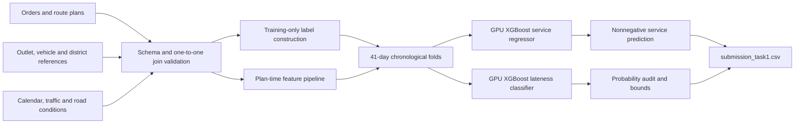
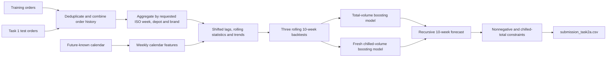
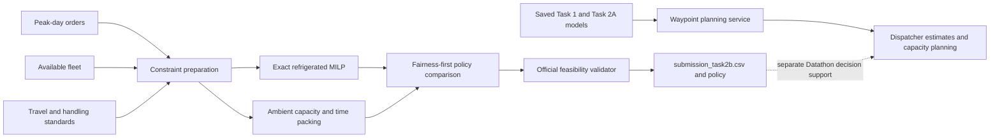

# Datathon Architecture Diagrams

## Task 1: service time and lateness

## Task 2A: weekly demand forecasting

## Task 2B and deployment concept

The deployment block is a proposed planning interface only. The booklet explicitly states that Datathon integration into the Hackathon application is not required.
